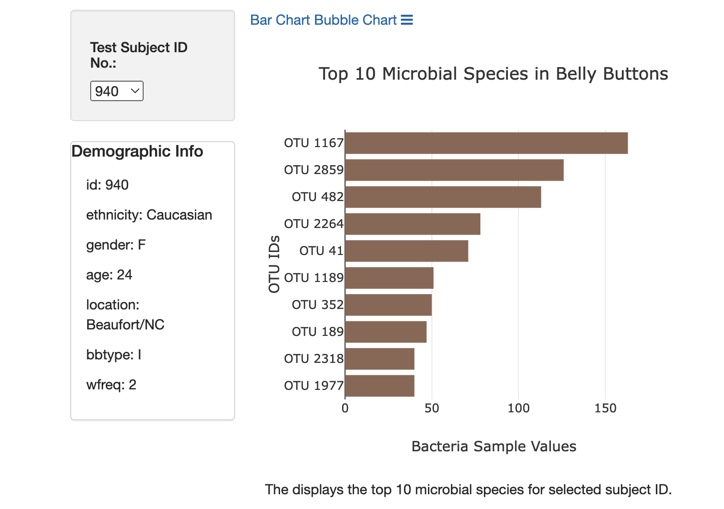
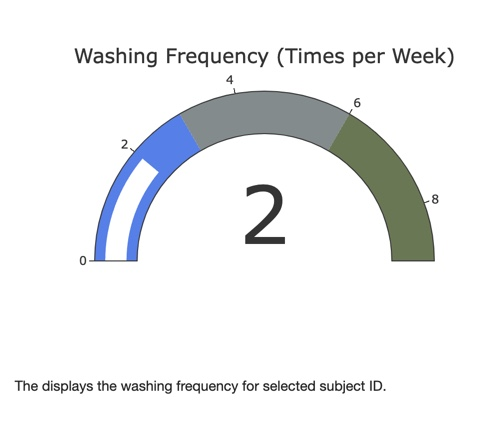

# plotly_challenge
Using JavaScript, HTML CSS, Plotly, & D3.js

# OVERVIEW
The purpose of this project is to create a dynamic website that displays three dynamic charts that with patients belly button bacterial data. That way, if Improbable Beef identifies a species as a candidate to manufacture synthetic beef, Roza's volunteers will be able to identify whether that species is found in their navel.

# RESULTS
Upon opening the website you see the data for patient ID 940, and you have the option to change the button by using the drop down.  

Here's the charts with below descriptions:
# Bar Chart 

I've also created a navigation bar to easily navigate to the bar and bubble charts. 

# Gauge Chart

# Bubble Chart

